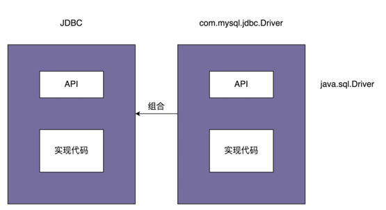

# 桥接模式

将抽象和实现解耦，让它们可以独立变化。
一个类存在两个（或多个）独立变化的维度，我们通过组合的方式，让这两个（或多个）维度可以独立进行扩展。”通过组合关系来替代继承关系，避免继承层次的指数级爆炸。

## 例子
- JDBC
  - JDBC 本身就相当于“抽象”。注意，这里所说的“抽象”，指的并非“抽象类”或“接口”，而是跟具体的数据库无关的、被抽象出来的一套“类库”。具体的 Driver（比如，com.mysql.jdbc.Driver）就相当于“实现”。注意，这里所说的“实现”，也并非指“接口的实现类”，而是跟具体数据库相关的一套“类库”。JDBC 和 Driver 独立开发，通过对象之间的组合关系，组装在一起。JDBC 的所有逻辑操作，最终都委托给 Driver 来执行。
  - 
